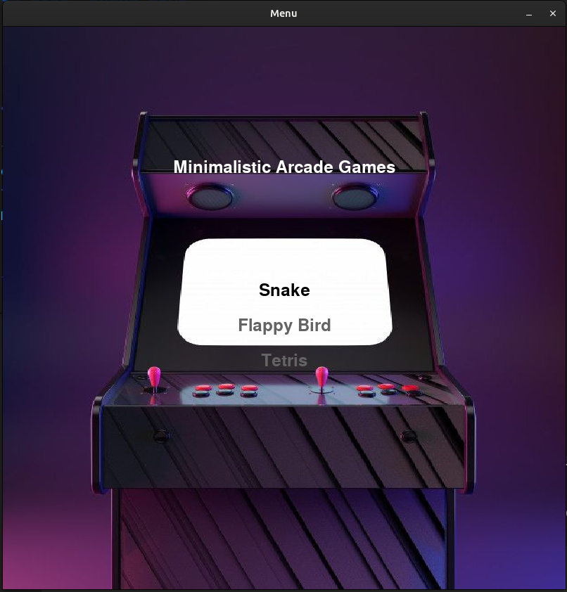
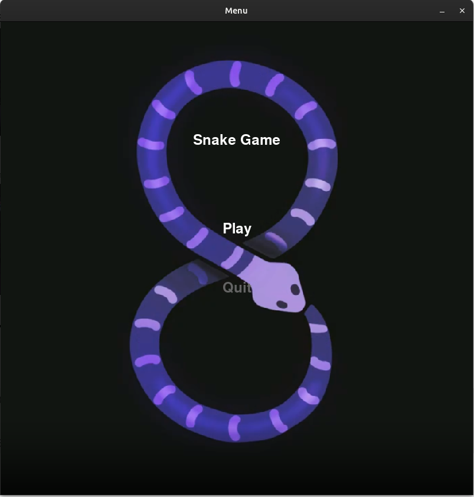
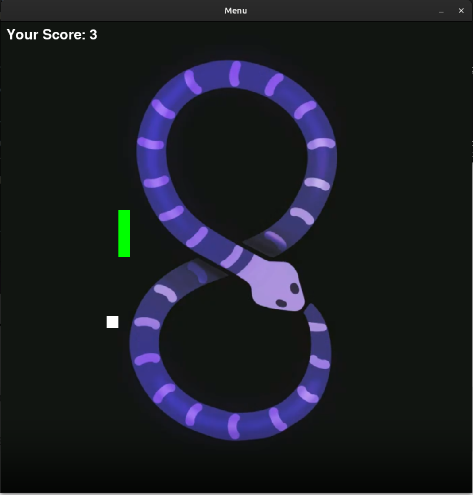
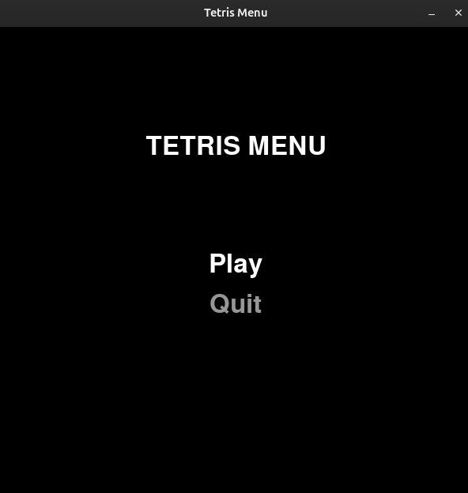
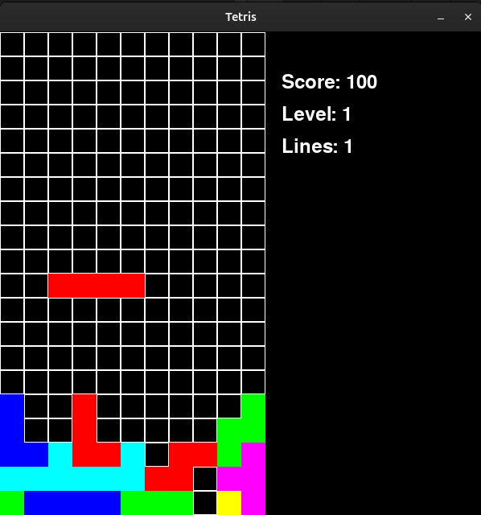
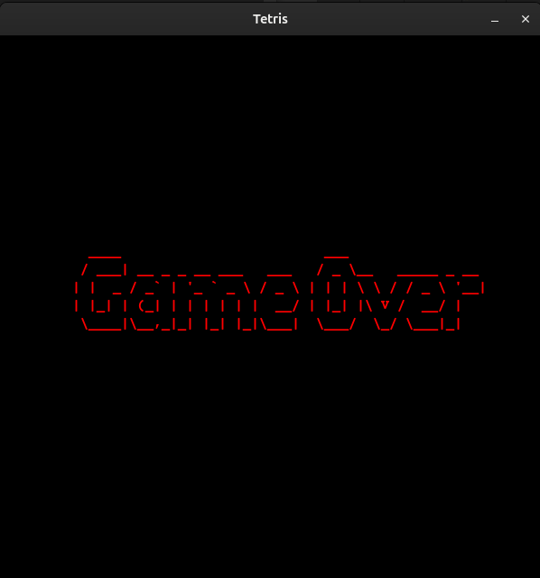
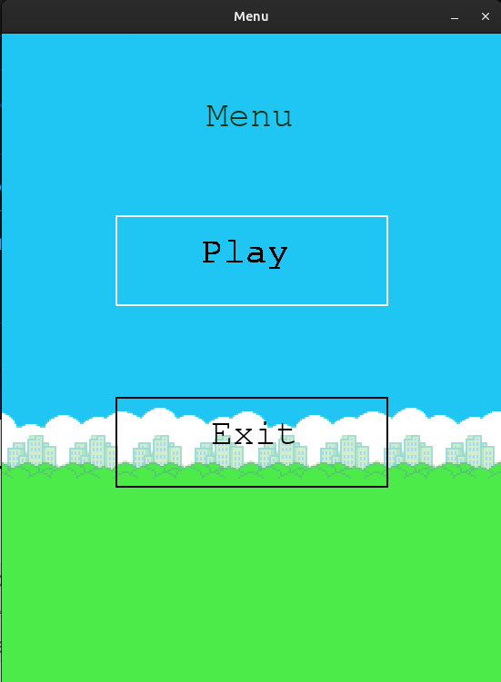
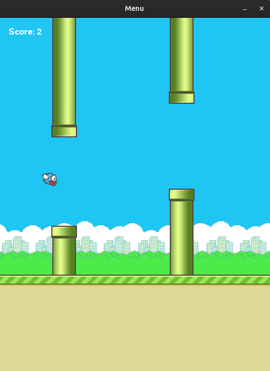
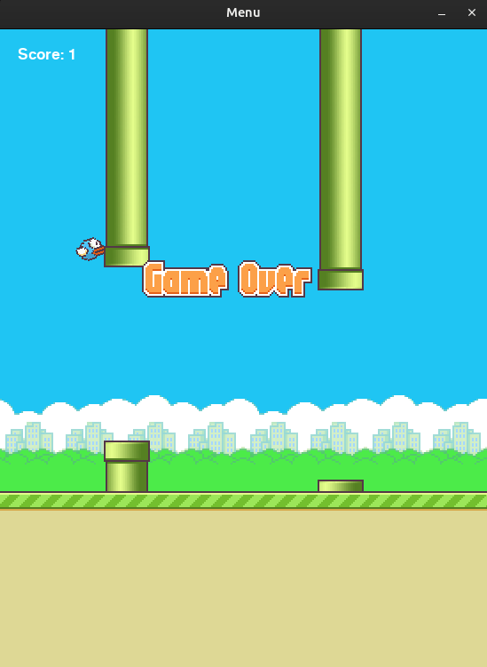

# README

#### Project name:
> Minimalistic-Arcade-Games

#### Team:
> - Babacea Alexandru
> - Cojocaru Malina
> - Velciu Diana

#### [Github link](https://github.com/malinacojocaru/Minimalistic-Arcade-Games)

#### Short description
- Our Python project combines three classic games ***<< Snake, Tetris and Flappy Bird >>*** into a single interactive experience.
- Players can navigate through dedicated menus for each game or use the centralized "All Games" menu.
- A joystick, powered by a Raspberry Pi Pico, is used for menu navigation and gameplay, adding a fun hardware element to the project.
- Along with the joystick, we considered it perfect for showing our newly discovered Python programming skills and reliving arcade nostalgia!

#### Programming Languages and Technologies Used
- This project is developed using **Python**.
- It leverages the **pygame module** for creating graphics, animations, and handling controls.
- A **joystick**, powered by a **Raspberry Pi Pico**, is used for navigating menus and playing games, adding an interactive dimension to the experience.
- The project demonstrates how Python can seamlessly integrate with hardware to create engaging and interactive applications.
- The **os module** is utilized for interacting with the operating system, specifically to:
    - Read the *PORT environment variable*.
    - Retrieve the script's directory, ensuring that file references are relative to the script's location.
- The **platform module** is used to detect the operating system, enhancing compatibility in scenarios where the *PORT environment variable* is not set.
- The **machine module** is used for the script running on the **Raspberry Pi Pico**.
- Use **Thonny IDE** or the **ampy tool** to upload *main.py from the raspberry_pi_pico_code directory* onto Raspberry Pi Pico.

#### Instructions
- Connect the pins from the joystick to the Raspberry Pi Pico as follows:
    - GND to GND
    - 3.3V to 3.3V
    - VRx to GP26_A0
    - VRy to GP27_A1
    - SW to GP28_A2
- Connect the Raspberry Pi Pico to your computer using a USB cable.
- Use **Thonny IDE** or the **ampy tool** to upload *main.py from the raspberry_pi_pico_code directory*.
> - Here are the instructions to use the **ampy tool**:
>   - pip install adafruit-ampy
>   - Go to the raspberry_pi_pico_code directory
>   - Use: ampy --port <PORT> put main.py (for example: ampy --port /dev/ttyACM0 put main.py)
>   - Restart the Raspberry Pi Pico to start executing your code (unplug the Raspberry Pi Pico and plug it back in)
- Set the **PORT** environment variable to ensure compatibility (for example: */dev/ttyACM0* on Linux or *COM3* on Windows).
> - The program should be executed from the **parent of the Minimalistic-Arcade-Games** directory.
> - Command: **python3 -m Minimalistic-Arcade-Games.menu_all.menu_all** (you can use either python or python3)
 - To run a certain game:
    - Navigate to the game directory: Minimalistic-Arcade-Games/<game_directory>
    ex: cd Minimalistic-Arcade-Games/flappy_bird_game
    - Run command: python3 -m <game_menu>
    ex: python3 -m flappy_menu 

#### General commands:
- The main menu and the menu of each game can be accessed via the **joystick**.
- To select a certain option, please press **enter**. 
- For the rest of the game, you will **only use the joystick**. (The button of the joystick was too sensitive to be used for accessing options)

***

#### Menu Navigation:
- Use the **joystick** to **move up and down** through the menu options.
- Press the **enter** button **to select** a menu item.
- From the "All Games" menu, choose one of the three games: ***Snake***, ***Tetris***, or ***Flappy Bird***

***

#### Game Controls and Rules:
- **Snake**:
> Use the joystick to control the snake's direction (up, down, left, right).
> The goal is to eat the food that appears on the screen, which makes the snake longer.
> Avoid running into the walls or the snake's own body, or the game ends.

  
  
  

***

- **Tetris**:
> Move the joystick left or right to position the falling blocks.
> Push the joystick up to rotate the blocks and down to drop them faster.
> The goal is to complete horizontal rows without gaps. Completed rows will disappear, and you earn points.
> The game ends if the stack of blocks reaches the top of the screen.

***

- **Flappy Bird**:
> Move the joystick up to make the bird flap its wings and move upward.
> The bird will fall automatically due to gravity otherwise.
> Navigate the bird through the gaps in the pipes without hitting them.
> The game ends if the bird crashes into a pipe or the ground.

***

#### Individual work
- **Babacea Alexandru**
> - Tetris game (game + tetris menu)
> - Worked together on debugging, Github conflicts, port problems
> - Joystick + Raspberry Pi Pico integration

- **Cojocaru Malina**
> - Snake game (game + snake menu)
> - The all games menu
> - Worked together on debugging, Github conflicts, port problems
> - Joystick + Raspberry Pi Pico integration

- **Velciu Diana Maria**
> - Flappy Bird game (game + flappy bird menu)
> - Worked together on debugging, Github conflicts, port problems
> - Joystick + Raspberry Pi Pico integration

#### Difficulties
- COM3 port wasn’t recognized; had to work a lot to solve this problem
- Github conflicts
- As beginners, it wasn’t so easy; we had to learn Python first
- Incompatibility between Raspberry Pi Pico and software
- Game design challenges
- Debugging complex interactions
- Bad communication between joystick and Raspberry Pi Pico
- Multiple commands sent simultaneously when controlling Tetris piece (e.g. moving right), requiring a solution to ensure responsive control
